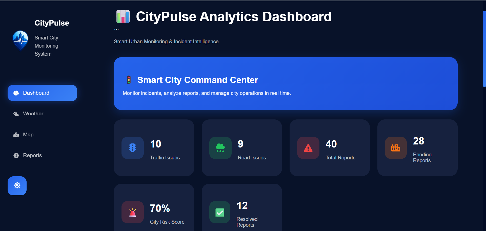
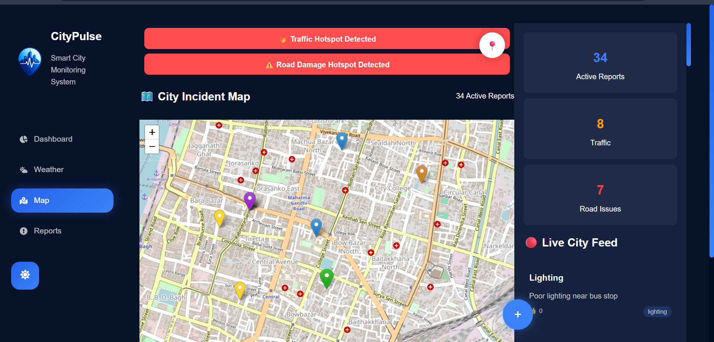
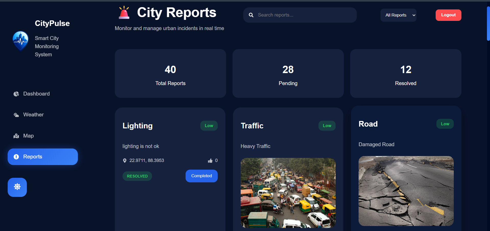
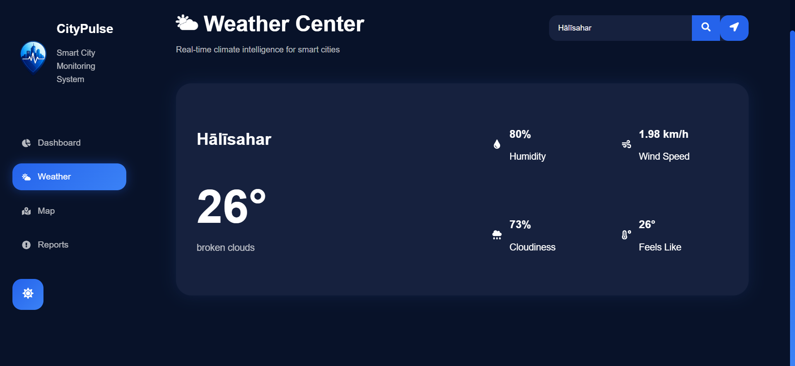

# 🚦 CityPulse 🌆

## AI-Powered Smart City Monitoring & Incident Management Platform

CityPulse is a full-stack smart city monitoring platform that enables citizens to report urban issues in real time while helping city authorities monitor, prioritize, and resolve incidents efficiently.

The platform combines interactive mapping, image-based incident reporting, community voting, real-time analytics, weather monitoring, hotspot detection, risk scoring, and administrative incident management.

---

# 📌 Overview

CityPulse provides a centralized platform where citizens can report infrastructure and public safety issues directly on a live map.

Administrators can review reports, track their status, monitor city-wide analytics, and prioritize critical incidents using risk scores and hotspot detection.

---

# 🌍 Problem Statement

Urban infrastructure issues are often reported late, tracked inefficiently, and resolved slowly due to a lack of centralized monitoring systems.

CityPulse addresses this challenge by enabling citizens to:

* Report incidents instantly
* Upload evidence images
* Pin exact locations on a map
* Vote on important issues
* Monitor city incidents in real time

while providing city authorities with actionable analytics and management tools.

---

# 🚀 Features

## 🗺️ Interactive Incident Reporting

* Report issues directly on the map
* GPS-based location capture
* OpenStreetMap integration
* Real-time marker generation
* Responsive map interface

---

## 🚨 Incident Categories

Citizens can report:

* 🚦 Traffic Issues
* 🛣️ Road Damage
* 🛡️ Safety Hazards
* 💡 Lighting Failures
* ♿ Accessibility Problems

---

## 📸 Image Upload Support

* Upload incident photographs
* Cloudinary integration
* Visual evidence attached to reports
* Image preview in reports and map markers

---

## 👍 Community Voting System

* Citizens can upvote incidents
* Community-driven prioritization
* Dynamic issue ranking

---

## 📈 Smart Priority Detection

Priority is automatically generated:

* 🔴 High Priority → Votes > 8
* 🟡 Medium Priority → Votes > 5
* 🟢 Low Priority → Votes ≤ 5

---

## 📊 Analytics Dashboard

Provides real-time city insights:

* Total Reports
* Pending Reports
* Resolved Reports
* Traffic Issue Count
* Road Issue Count
* Weekly Activity Graph
* Incident Distribution Pie Chart
* Recent Activity Feed

---

## 🚨 Risk Score System

CityPulse generates a dynamic city risk score based on:

* Active incident count
* Pending reports
* Community engagement
* Incident density

---

## 🔥 Hotspot Detection

Automatically detects high-risk areas based on incident concentration.

Examples:

* 🔥 Traffic Hotspot Detected
* ⚠️ Road Damage Hotspot Detected

---

## 📂 Incident Management System

Administrative dashboard supports:

* Search reports
* View uploaded images
* Manage incident status
* Track incident lifecycle

### Status Workflow

```text
Pending
   ↓
In Progress
   ↓
Resolved
```

---

## 🔐 Admin Authentication

* Protected Admin Login
* Session-based access control
* Restricted administrative functionality

---

## 🌦️ Weather Monitoring

Integrated weather dashboard displaying:

* Current weather conditions
* Temperature
* Environmental information

Helps correlate:

* Rainfall and flooding
* Visibility and traffic incidents
* Weather and road safety

---

## ☁️ Real-Time Synchronization

Powered by Firebase Firestore:

* Live report updates
* Dynamic map markers
* Instant dashboard synchronization
* Real-time voting updates

using Firestore listeners (`onSnapshot`).

---

## 📧 Automated Email Notifications

When a citizen submits a report:

* Incident details are emailed automatically
* Location information is included
* Uploaded image links are attached

using EmailJS integration.

---

# 🧠 System Workflow

1. User selects a location on the map
2. User chooses an incident category
3. User enters incident details
4. User uploads an image (optional)
5. Data is stored in Firebase Firestore
6. Data is synchronized to MongoDB
7. Dashboard updates automatically
8. Citizens can upvote incidents
9. Administrators manage incident status
10. Risk scores and hotspots update dynamically

---

# 🛠️ Tech Stack

## Frontend

* React.js
* React Router
* CSS3
* React Icons
* Recharts

## Backend

* Node.js
* Express.js

## Database

* MongoDB Atlas
* Firebase Firestore

## Maps & Visualization

* React Leaflet
* OpenStreetMap

## Cloud Services

* Cloudinary
* EmailJS

## Deployment

* Vercel (Frontend)
* Render (Backend)
* Firebase Hosting

---

# 📁 Project Structure

```bash
src/
│
├── components/
│   └── Sidebar.js
│
├── pages/  
│   ├── AdminLogin.js
│   ├── Dashboard.js
│   ├── MapPage.js
│   ├── Reports.js
│   └── Weather.js
│
├── styles/ 
│   ├── AdminLogin.css
│   ├── Dashboard.css
│   ├── MapPage.css
│   ├── Reports.css
│   ├── Sidebar.css
│   └── Weather.css
│
├── firebase.js
├── App.js
├── index.js
│
├── backend/
│   ├── controllers/
│   ├── models/
│   ├── routes/
│   └── server.js
│
└── README.md
```

---

# ⚙️ Installation

## 1️⃣ Clone Repository

```bash
git clone https://github.com/Saswatiiiii/citypulse.git
```

---

# ⚙️ Installation

## Clone Repository

```bash
git clone https://github.com/Saswatiiiii/citypulse.git
```

## Install Frontend Dependencies

```bash
npm install
```

## Start Frontend

```bash
npm start
```

## Start Backend

```bash
cd backend
npm install
npm start
```

---

# 🌐 Live Demo

### Frontend

https://citypulse-dusky.vercel.app


### Backend API

https://citypulse-h7va.onrender.com

---

# 📷 Screenshots

## 📊 Dashboard



---

## 🗺️ Map Page



---

## 📂 Reports Page



---

## 🌦️ Weather Page



---


# 🌟 Future Enhancements

* AI-based incident prediction
* Emergency alert system
* Route optimization
* Reverse geocoding
* IoT sensor integration
* Pollution monitoring
* Predictive traffic analytics
* Citizen reputation system
* Mobile application

---

# 👨‍💻 Developed By

* Saswati Chatterjee
* Debolina Mitra

---

# 📄 License

This project was developed for educational, research, portfolio, and hackathon purposes.
